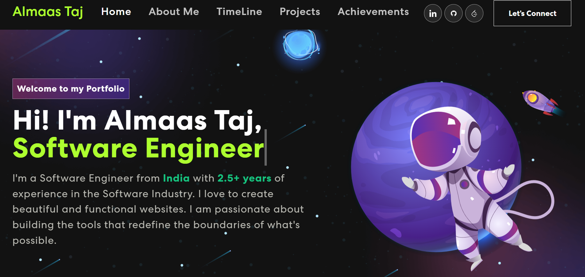
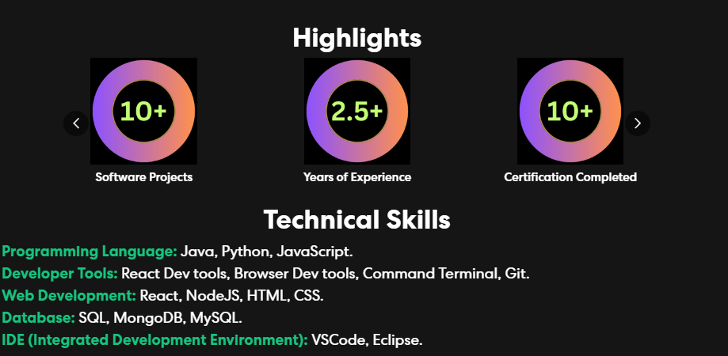
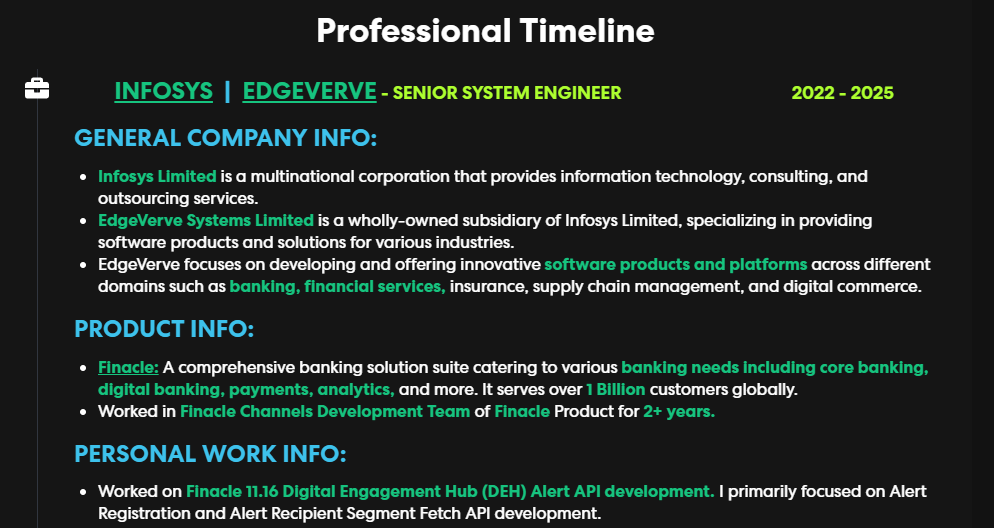
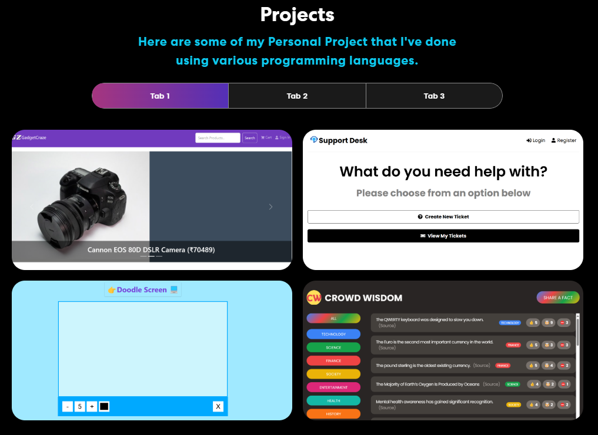
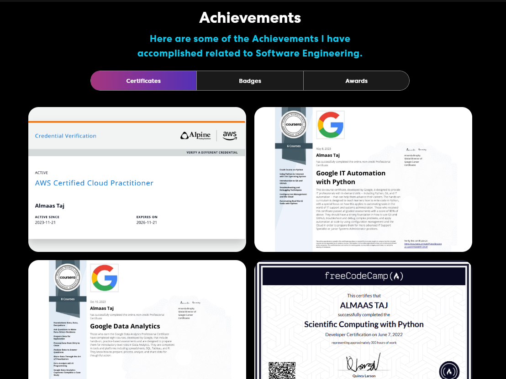
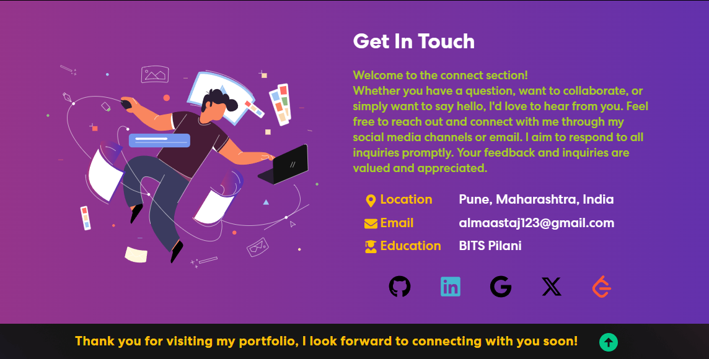

# Portfolio - Website

This Project is [Portfolio - Website](https://almaastaj.github.io/) curated collection of my creative work, showcasing my skills and experience in Software Engineering.

## Home Page

This section contains a short introduction of me.

## About Me Section

This section gives some general information related to me. It also contains some highlights and technical skills that I am proficient in.

## Professional Timeline Section

This section is a chronological overview of my career journey, highlighting key roles, responsibilities, and accomplishments at each stage.

## Projects Section

This section contains a curated selection of my most impactful projects, showcasing my skills, creativity, and problem-solving abilities. Each project includes a brief description, images, and links to live work.

## Achievements Section

This section is a showcase of certifications, badges, awards and recognition with verification links.

## Let's Connect Section

This section provides how can you connect with me using social media, emails, etc.

