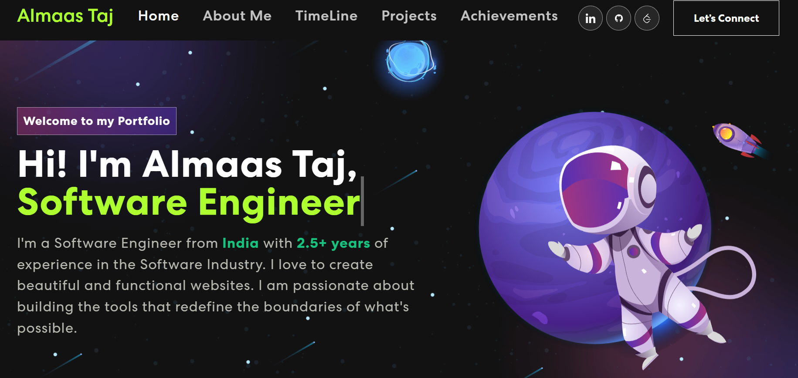
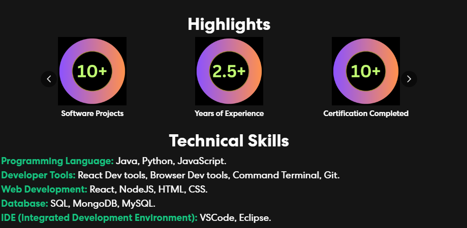
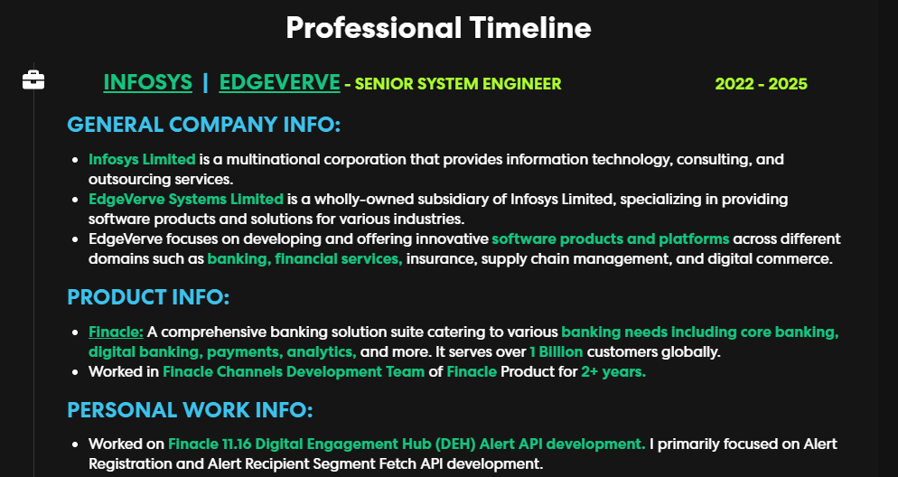
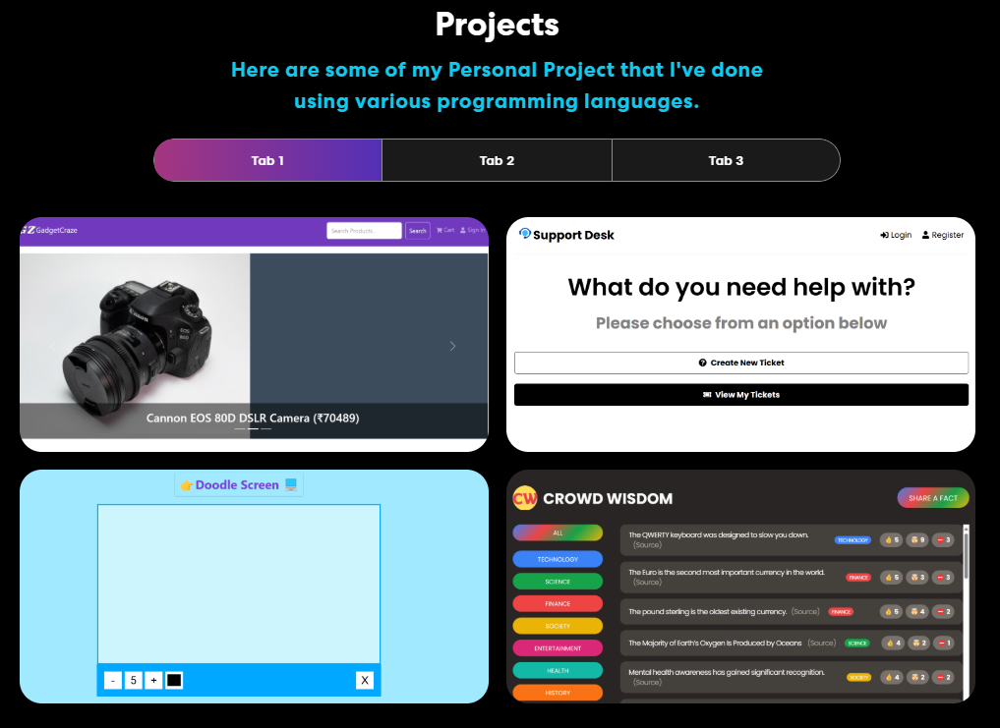
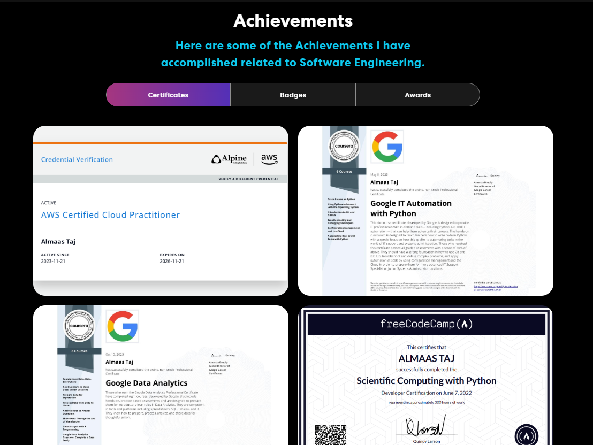
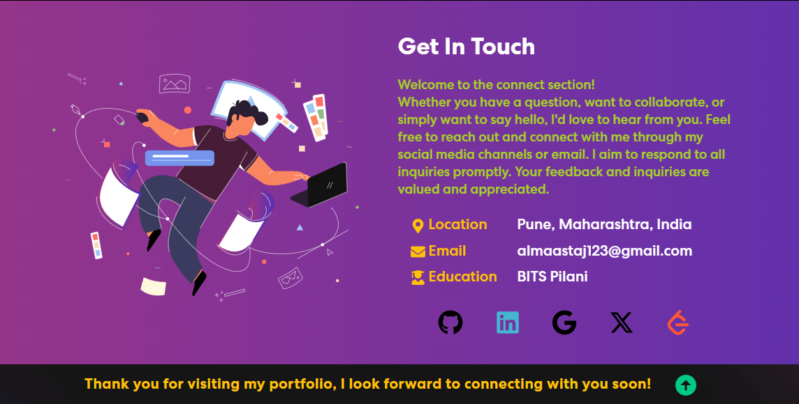

# Portfolio - Website

This Project is a [Portfolio - Website](https://almaastaj.github.io/) which contains curated collection of my creative work, showcasing my skills and experience in Software Engineering.

The website is designed to provide an overview of my professional journey, highlight key projects, and demonstrate my expertise in the field. It serves as a platform to share my accomplishments, skills, and experiences with potential employers, clients, and collaborators.

## Home Page

This section contains a short introduction of me.

## About Me Section

This section gives some general information related to me. It also contains some highlights and technical skills that I am proficient in.

## Professional Timeline Section

This section is a chronological overview of my career journey, highlighting key roles, responsibilities, and accomplishments at each stage.

## Projects Section

This section contains a curated selection of my most impactful projects, showcasing my skills, creativity, and problem-solving abilities. Each project includes a brief description, images, and links to live work.

## Achievements Section

This section is a showcase of certifications, badges, awards and recognition with verification links.

## Let's Connect Section

This section provides how can you connect with me using social media, emails, etc.

